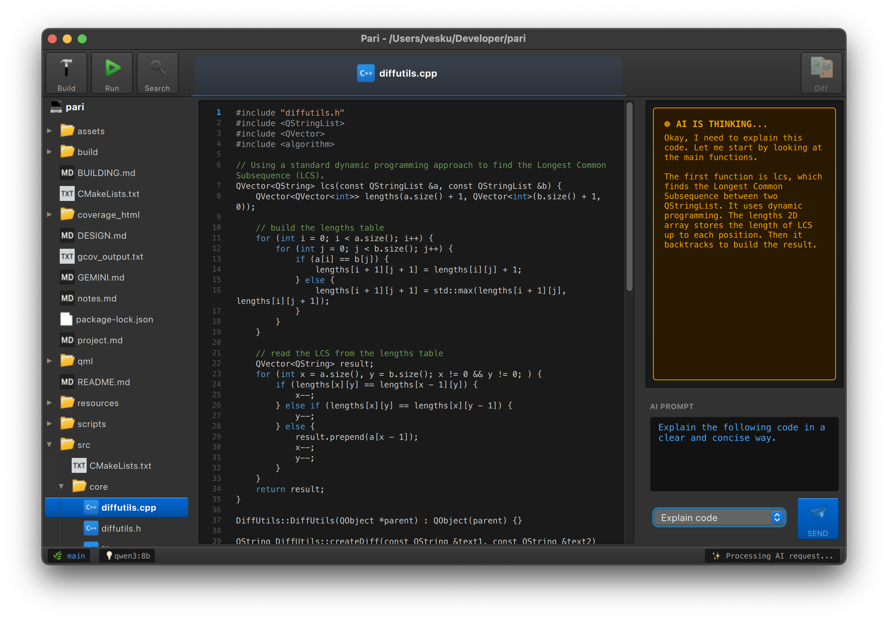

# Pari - Local AI Coding Companion



Pari is a desktop application designed to be a local AI-powered coding partner. It leverages local Large Language Models (LLMs) through Ollama to assist with coding tasks.

## Purpose

The primary goal of Pari is to provide a simple way to use LLMs for:

*   **Code Review:** Get feedback and suggestions on your code.
*   **Documentation:** Generate comments and documentation for your code.
*   **Code Generation:** Get help with writing new code snippets.

Pari aims to be a trusted, local utility that can assist with coding tasks in an offline-first environment.

## Key Features

*   **Local LLM Integration:** Full streaming support for local Ollama instances.
*   **Precision Code Editor:** Syntax highlighting for C++, QML, Markdown, Shell, **Swift**, and **JavaScript**. Supports auto-indentation and LSP integration.
*   **Workspace Investigation:** Integrated project-wide search and global replacement engine utilizing background-threaded C++ scanning.
*   **Atelier Workspace Status:** Structured Git diffs with precision line navigation and badging for untracked "NEW" files.
*   **Tactile Design:** A high-fidelity "Developer's Atelier" aesthetic featuring "Machine Bezel" navigation and premium tactile refinements.
*   **Integrated Tools:** Built-in build system, Grep-mode line filtering, and interactive AI-suggested changes.

## Testing & Quality

### Unit & UI Testing

The project includes a robust automated test suite covering both C++ logic and QML UI components.
*   **Unit Tests:** 94 tests verifying core backend logic using the Qt Test framework.
*   **UI Tests:** 141 tests verifying component behavior and state using `QtQuickTest`.
*   **Total Tests:** 235 passing tests ensuring system stability.

### Code Coverage

Pari maintains a high standard of quality with **85.7%** line coverage. You can generate a detailed HTML report:

```bash
# Reconfigure with coverage enabled
cmake -B build -DENABLE_COVERAGE=ON
cmake --build build

# Generate report
./scripts/coverage_report.sh
open coverage_html/index.html
```

### Smoke Test

The application includes a smoke test that verifies if the main interface can be loaded successfully. This is triggered by the `--selfcheck` command-line flag.

```bash
# Example (macOS)
./build/src/pari.app/Contents/MacOS/pari --selfcheck
```

## Getting Started

See [BUILDING.md](BUILDING.md) for detailed build instructions and prerequisites.
