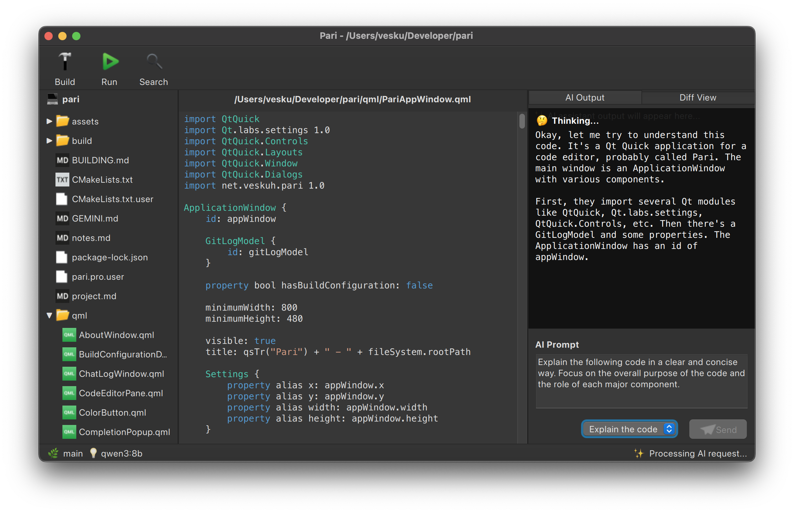

# Pari - Your Local AI Coding Companion



Pari is a desktop application designed to be your local AI-powered coding partner. It leverages the power of local Large Language Models (LLMs) through Ollama to assist you with various coding tasks, right on your machine.

## Purpose

The primary goal of Pari is to provide a seamless and efficient way to use LLMs for:

*   **Code Review:** Get feedback and suggestions on your code.
*   **Refactoring:** Improve the structure and quality of your code.
*   **Documentation:** Generate comments and documentation for your code.
*   **Code Generation:** Get help with writing new code snippets.

Pari is not intended to replace a full-featured IDE or powerful cloud-based AI services. Instead, it aims to be a trusted, local utility that can assist with coding tasks in an offline-first environment, ensuring your code remains private and secure.

## Features

*   **Local LLM Integration:** Pari communicates with a local Ollama instance to send prompts and receive responses.
*   **File System Browser:** Browse your local file system and open files in the editor.
*   **Code Editor:** A basic code editor with syntax highlighting for various languages.
*   **Send Selection:** Send only the selected part of the code to the LLM.
*   **C++ Formatting:** Format C++ code using `clang-format`.

## Current Status

Pari is currently in the **early development phase**. The foundational features are in place:

*   **Basic UI:** A user interface built with QML, featuring a file system browser, a code editor, and panes for AI interaction.
*   **File System Integration:** You can browse your local file system and open files in the editor.
*   **LLM Integration:** Pari can communicate with a local Ollama instance to send prompts and receive responses.
*   **Core Functionality:** The application can send the content of the code editor to the LLM and display the generated output.

The project is a hobby project (with Gemini) and somewhat actively being developed.

## Directory Structure

The project is organized into the following directories:

*   `src/`: Contains the C++ source code for the application.
    *   `core/`: Core application logic, such as settings management and file system access.
    *   `editor/`: Code editor components.
    *   `formatting/`: Code formatting and syntax highlighting.
    *   `integrations/`: Integration with external tools like Ollama and `clangd`.
*   `qml/`: Contains the QML source code for the user interface.
*   `assets/`: Contains assets like icons and images.
*   `tests/`: Contains the unit tests for the application.
*   `build/`: The build directory, where the compiled application and test executables are placed.

## Testing

This project includes unit tests and a smoke test to ensure code quality and application stability. These tests are integrated into the CI workflow and are run automatically on every push and pull request.

The tests are configured to use a separate settings file to avoid interfering with the main application's settings.

### Unit Tests

The unit tests are built using the Qt Test framework and can be found in the `tests/` directory. To run the unit tests locally, first build the project, and then execute the test binary:

```bash
mkdir build
cmake -S . -B build
cmake --build build
./build/tests/tst_all
```

### Smoke Test

The application includes a smoke test that verifies if the main QML interface can be loaded successfully. This is triggered by the `--selfcheck` command-line flag.

**On macOS:**
```bash
./build/src/pari.app/Contents/MacOS/pari --selfcheck
```

**On Linux:**
```bash
./build/src/pari --selfcheck
```

**Note:** Running these tests locally requires a proper Qt development environment. The test scripts are primarily designed for use in automated testing environments, such as the GitHub Actions CI workflow, where the environment is pre-configured with all necessary dependencies. If you are running the tests locally, you may need to install Qt development packages first. For example, on a recent Debian/Ubuntu-based system, you can install the necessary packages with:

```bash
sudo apt-get install qt6-base-dev qt6-declarative-dev qt6-tools-dev qml6-module-qtquick qml6-module-qtquick-controls qml6-module-qtquick-dialogs qml6-module-qtquick-layouts qml6-module-qtquick-window qml6-module-qtqml-workerscript qml6-module-qtquick-templates
```